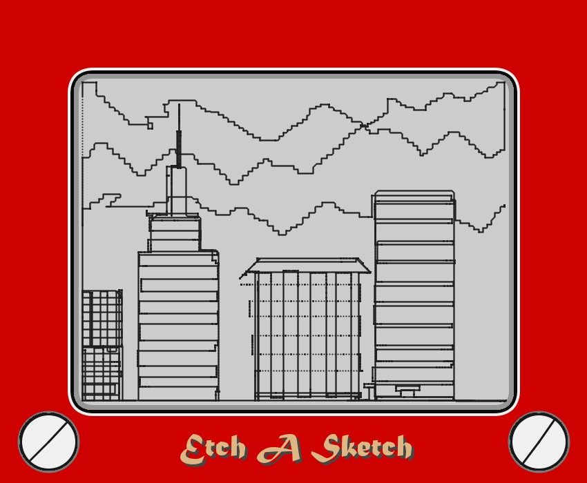

<h1 align="center" ><b>Etcch-A-Sketch</b>
</h1>
<h1 align="center"></h1>

<h5 align="center">

</h5>

<h5 align="center">Drawing app inspired from the popular toy Etch A Sketch
</h5>

<h1 align="center">

</h1>

 

[Etch A Sketch](https://en.wikipedia.org/wiki/Etch_A_Sketch) is a mechanical drawing toy invented by André Cassagnes of France and subsequently manufactured by the Ohio Art Company and now owned by [Spin Master](https://www.spinmaster.com/en-US/brands/etch-a-sketch/).

 

## :sparkles: Install

Make sure you have [Java](https://java.com/en/download/) installed. [Download](https://github.com/Karthikeshwar1/Etcch-A-Sketch/releases) the compressed file, extract it, and run the main file.

 

## :seedling: How to use

- Use **arrow keys** to move and draw
- Hold down **shift** to increase speed or **ctrl/command** to decrease speed
- Press **T** to take a screenshot
- Press **C** or **shake the window** to clear the screen!

 

<h2></h2>

 

#### Note:

(i) After starting the application, if input doesn't work, then click in the middle of the window.

(ii) In Microsoft Windows, shaking the window may cause other windows to minimize, which is normal, and is a feature of the OS.

 

## :information_source: About project

- Made with [Processing 3,](https://processing.org/) a popular graphical library and IDE for [creative coding](https://en.wikipedia.org/wiki/Creative_coding)
- Etch A Sketch is a trademark of Spin Master Ltd.
- Image by <a href="https://commons.wikimedia.org/wiki/File:Taj_Mahal_drawing_on_an_Etch-A-Sketch.jpg">Etcha</a>, <a href="https://creativecommons.org/licenses/by-sa/3.0">CC BY-SA 3.0</a>, via Wikimedia Commons

 

## :page_facing_up: License

 
